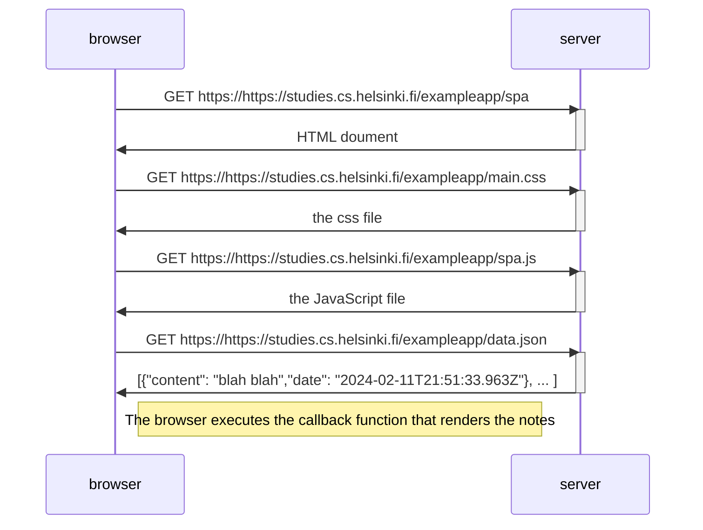

```mermaid
sequenceDiagram
  participant browser
  participant server

  browser->>server: GET https://https://studies.cs.helsinki.fi/exampleapp/spa
  activate server
  server->>browser: HTML doument
  deactivate server

  browser->>server: GET https://https://studies.cs.helsinki.fi/exampleapp/main.css
  activate server
  server->>browser: the css file
  deactivate server

  browser->>server: GET https://https://studies.cs.helsinki.fi/exampleapp/spa.js
  activate server
  server->>browser: the JavaScript file
  deactivate server

  browser->>server: GET https://https://studies.cs.helsinki.fi/exampleapp/data.json
  activate server
  server->>browser: [{"content": "blah blah","date": "2024-02-11T21:51:33.963Z"}, ... ]
  deactivate server

 Note right of browser: The browser executes the callback function that renders the notes 
```
